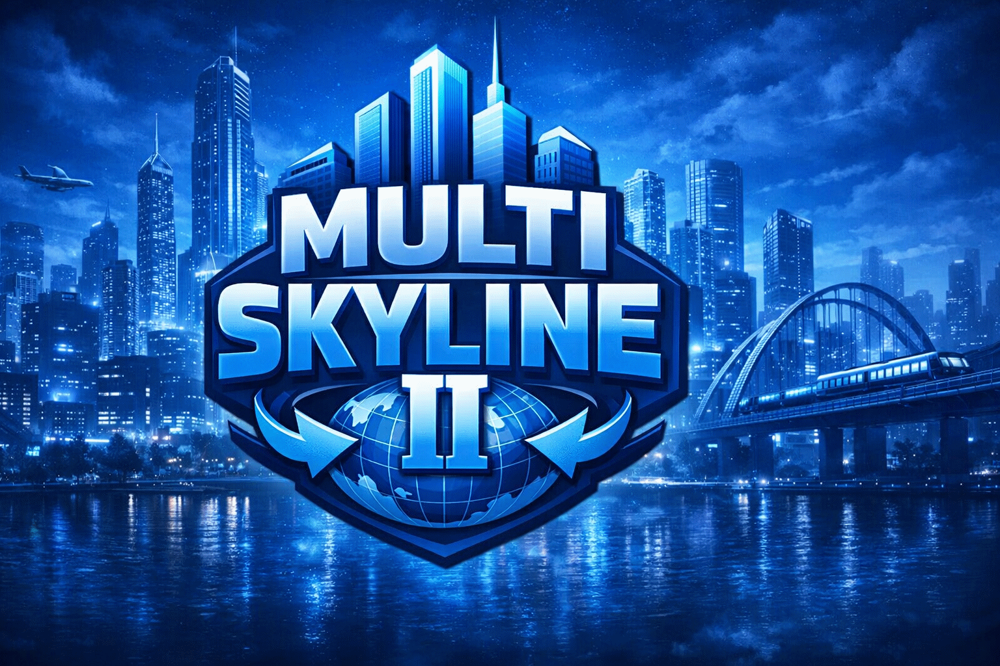

<p align="center">
  
</p>

# MS2 - MultiSkyLines II

City Skylines II Mulitplayer Mod

Bring your cities together with a real-time multiplayer resource trading experience.

### Current status
- Prototype / Work in progress
- Features are evolving quickly
- Multiplayer sessions may still have bugs
- Contracts are still under active development and are not reliable yet

### Main features
- Host / Client multiplayer mode
- Live multiplayer HUD to monitor connected players' city information in real time
- Real-time city stats (population, money, utilities, simulation state)
- Network and session diagnostics in the Debug tab
- Contract system for Electricity, Water, and Sewage (experimental / in development)
- Per-tick settlements and synchronized contract events

### Quick start
1. Open the mod settings and configure Host or Client mode.
2. Keep port `25565` open and reachable for remote clients.
3. Start or join a city session.
4. Press `F8` in-game to open/close the multiplayer HUD.

### Notes
- This mod is not considered stable yet.
- For remote play, use the host public/local IP (not localhost).
- If anything desyncs, check the HUD Debug tab logs first.
- Contracts can produce incorrect behavior for now; use them as test/preview functionality.

## Build

### Prerequisites
- .NET SDK installed (`dotnet` command available)
- Cities Skylines II modding toolchain configured (as used by this project)
- Node.js/npm for UI build (triggered by the project build)

### Compile the full solution
```powershell
dotnet build MultiSkyLinesII.sln -nologo
```

### Compile only the main mod project
```powershell
dotnet build MultiSkyLinesII.csproj -nologo
```

## Tests

### Run all unit tests
```powershell
dotnet test tests\MultiSkyLineII.Tests\MultiSkyLineII.Tests.csproj -nologo
```

### Test project location
- `tests/MultiSkyLineII.Tests/MultiSkyLineII.Tests.csproj`
